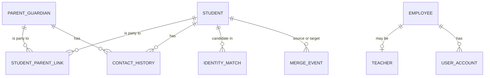
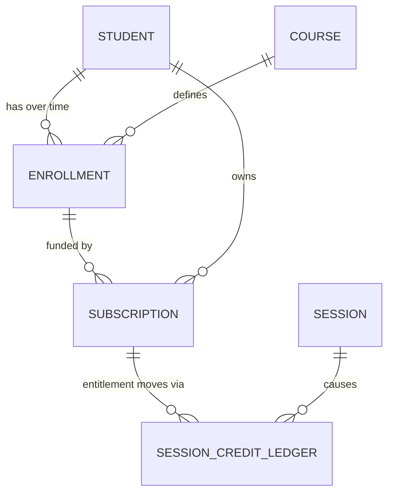
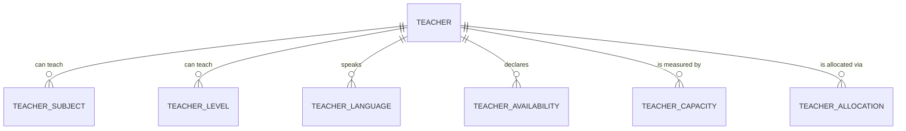
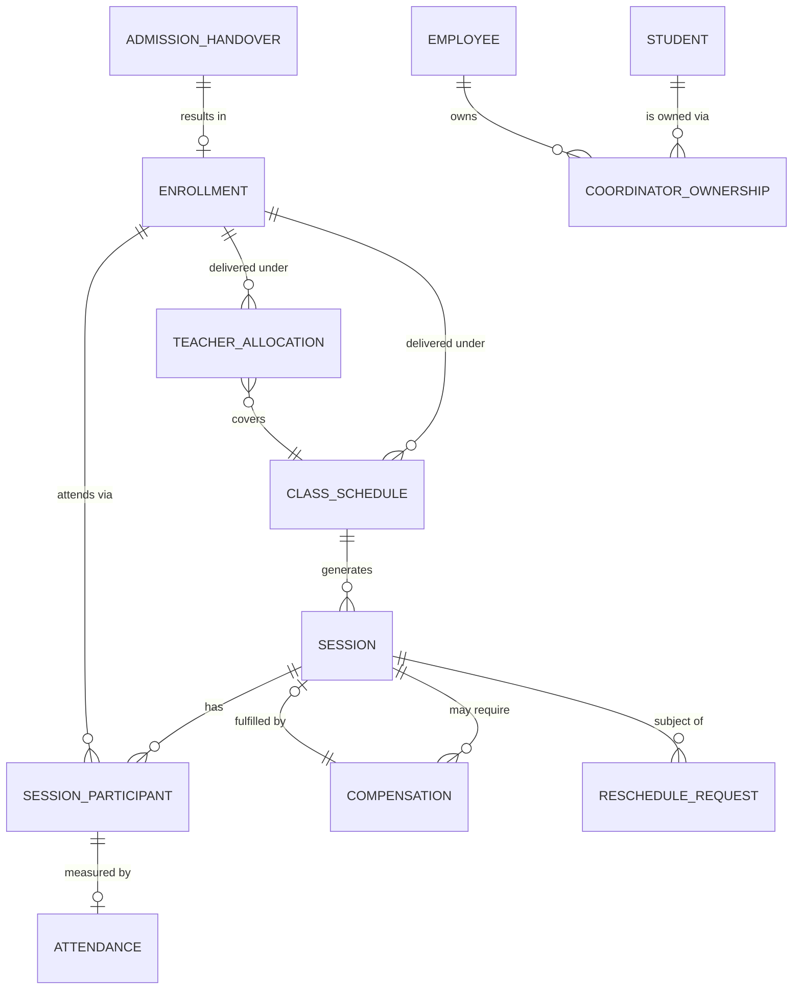
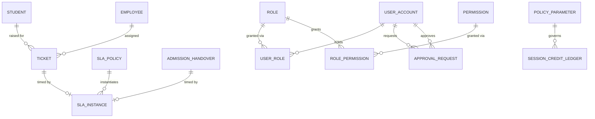
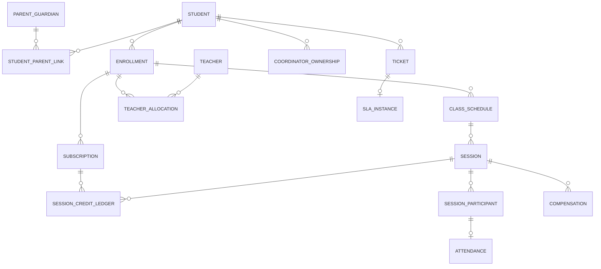

# 01 — Entity Relationship Model (Phase 1)

The Data Dictionary's core chain (DD §3, Master §6.2):

```
Parent/Guardian → Student → Enrollment → Subscription → Payment*
Enrollment → Class Schedule → Sessions → Attendance
```

\* Payment is Phase 4. Phase 1 holds only `subscription.external_payment_ref`.

Below, that chain is expanded into a validated logical model, one domain at a time.

---

## Modelling decisions that apply throughout

| # | Decision | Rationale |
|---|---|---|
| M1 | Every entity has an internal `uuid` primary key **plus** an immutable, unique `public_id` in the DD §4 format (`STU-2026-000184`). | Business IDs are stable and human-facing; surrogate keys keep joins narrow and let the ID format evolve without re-keying. Satisfies "never use names/phones as identifiers" (DD §2). |
| M2 | **No polymorphic foreign keys.** Where an entity can attach to more than one parent, use one nullable FK per parent plus a `CHECK` that exactly one is set. | A polymorphic `owner_type`/`owner_id` pair cannot be enforced by the database. Given rule 21 ("every critical action attributable"), losing referential integrity is not acceptable. |
| M3 | Effective-dated entities carry `valid_from`, `valid_to` (NULL = open), `is_current`, `superseded_by_id`, `change_reason`, `requested_by`, `approved_by`. | Business history is a first-class record, not an audit artifact (DD §13, §14; rule 12). |
| M4 | **Every session has a `session_participant` row, including 1-to-1.** | Avoids special-casing group classes later. Attendance and credit consumption are per-participant, not per-session. |
| M5 | Reference/master data (`course`, `subject`, `level`, `language`) are tables, not enums. | Master §5 Domain 1 explicitly scopes "course, subject, master records" to Phase 1, and allocation matching (Master §8) requires them as filterable dimensions. |
| M6 | External identifiers appear **only** in `external_id_map`. | Rule 26 — no Merithub/TeliCRM ID column exists on any core table. |

---

## A. Identity & Master Data



| Relationship | Cardinality | FK optional? | Source | Notes |
|---|---|---|---|---|
| Student ↔ Parent | `m..n` via `student_parent_link` | — | DD §5 | A parent may have many students; a student may have many authorised guardians. The link itself carries `is_primary_contact`, `relationship_type`, `valid_from/to`, `may_receive_reports`, `may_request_changes` — DD §5 requires the relationship be its own record when permissions or validity dates matter. |
| Student → primary guardian | derived, exactly `1` current | — | DD §6.1 | Enforced as: exactly one `student_parent_link` per student with `is_primary_contact = true AND is_current`. Not a column on `student`. |
| Contact History → Student **or** Parent | `1` owner | Both FKs nullable, `CHECK` exactly one | DD §7 | Preserves historical phone/email/name with `effective_from/to`, `is_primary`, `is_verified`. Rule 5: contact detail is history, never identity. |
| Identity Match → Student | `0..n` candidates per attempted creation | — | DD §7, Master §6.4 | Stores candidate set, match signals, confidence, decision, reviewer. Retained even when the decision is "not a duplicate" — the negative decision is itself audit evidence. |
| Merge Event → Student (source), Student (target) | `1` each | Both mandatory | DD §7 | Source student is **retained**, status `Merged`, with `merged_into_student_id`. Never deleted (rule 4). |
| Employee → Teacher | `1 : 0..1` | `teacher.employee_id` **nullable** | DD §29, CLAUDE.md default | Nullable so contractors exist as teachers without an HR record. |

**Master data:** `course ||--o{ enrollment`, `subject`, `level`, `language`. `course` may span
multiple subjects; `enrollment` references exactly one `course`, one `subject`, one `level`.

---

## B. Commercial & Entitlement



| Relationship | Cardinality | FK optional? | Source | Notes |
|---|---|---|---|---|
| Student → Enrollment | `1 : 0..n` | mandatory | DD §8, rule 20 | Multiple historical **and** concurrent enrollments permitted (different subjects). |
| Enrollment → Subscription | `1 : 0..n` | `subscription.enrollment_id` **nullable** | DD §9 | DD §9 says "Enrollment ID where applicable" — a subscription may be purchased before the enrollment exists, or cover a student generally. Nullable, with a business rule that it must be linked before the first session is scheduled. |
| Student → Subscription | `1 : 0..n` | mandatory | DD §9 | Always present even when `enrollment_id` is null, so entitlement always has an owner. |
| Subscription → Credit Ledger | `1 : 1..n` | mandatory | Master §15.7 | **Append-only.** The purchase itself is the first entry (`+purchased`). Balances are derived sums, never stored as authoritative columns. |
| Ledger entry → Session | `1 : 0..1` | nullable | Master §15.7 | Null for purchase, expiry and manual adjustment entries; set for consumption/protection/compensation entries. |

**Critical:** `subscription` has **no** `sessions_remaining` column of record. DD §9 lists those
counts as *concepts*; they are materialised as a derived view reconcilable from the ledger
(rule 16, rule 17).

---

## C. Workforce & Capacity



| Relationship | Cardinality | Source | Notes |
|---|---|---|---|
| Teacher → Subject / Level / Language | `m..n` each | DD §11 | Capability dimensions for allocation matching (Master §8). `teacher_language` carries a `is_bilingual_pair` flag to represent Tamil-English / Hindi-English (Master §13.1). |
| Teacher → Availability | `1 : 0..n` | DD §12.1 | Typed `regular` (recurring weekday) \| `specific_date` \| `temporary` \| `unavailable`, each effective-dated. Rule 8: **availability ≠ capacity**. |
| Teacher → Capacity | `1 : 0..n` | DD §12.2 | One row per (teacher, time-slot, effective period), holding planned / allocated / free / reserved minutes. **Phase 1 stores current capacity only.** Forecast capacity (expected releases from breaks and subscription completion, DD §12.3) is deferred to Phase 5. |

---

## D. Operations & Delivery — the core chain



| Relationship | Cardinality | FK optional? | Source | Notes |
|---|---|---|---|---|
| Admission Handover → Enrollment | `1 : 0..1` | nullable until allocated | Master §8 | The handover record exists from the moment Sales hands over, before an enrollment is created. It carries preferred days, primary and alternative timing options, demo assessment and demo feedback. |
| Student → Coordinator Ownership | `1 : 1..n` | mandatory | DD §14 | **Effective-dated.** Typed by `ownership_role` (onboarding \| student_success \| retention \| operations \| ticket \| escalation). At most one current row **per role** per student — a student legitimately has an onboarding owner and a ticket owner simultaneously. Rule 12: transfers close and open rows, never UPDATE in place. |
| Enrollment → Teacher Allocation | `1 : 1..n` | mandatory | DD §13 | **Effective-dated.** At most one current allocation per enrollment. A teacher change closes the old row (`valid_to`, `superseded_by_id`) and opens a new one, carrying `previous_teacher_id`, `change_reason`, `requested_by`, `approved_by` (Master §14.3). |
| Allocation → Class Schedule | `n : 1` | mandatory | DD §13 | Allocation is **teacher + schedule**, not teacher alone (rule 9). |
| Enrollment → Class Schedule | `1 : 1..n` | mandatory | DD §15 | Versioned: a day/time change supersedes the schedule rather than editing it. At most one current per enrollment. |
| Class Schedule → Session | `1 : 0..n` | mandatory | DD §16, rule 7 | **A recurring schedule is not a session.** Sessions are materialised occurrences. A compensation session also belongs to a schedule but is flagged `session_purpose = 'compensation'`. |
| Session → Session Participant | `1 : 1..n` | mandatory | [ENGINEERING] M4 | Exactly one row for 1-to-1; many for group. Carries `enrollment_id` and `student_id`. |
| Session Participant → Attendance | `1 : 0..1` | mandatory | DD §17 | Attendance is **per student per session**, not per session. Correct for group from day one. Holds scheduled/attended minutes, computed percentage, `manual_correction_flag`, `correction_reason`, `corrected_by`, `approved_by`. |
| Session → Compensation | `1 : 0..n` | `original_session_id` mandatory | DD §18 | `compensation.compensation_session_id` is **nullable** until the makeup is scheduled. |
| Compensation → Session (fulfilment) | `0..1 : 1` | nullable | DD §18, rule 18 | **The compensation session is a new session. It must never modify `class_schedule`.** Enforced: a session whose `id` appears as a `compensation_session_id` must have `session_purpose = 'compensation'`, and creating one must not write to `class_schedule`. |
| Session → Reschedule Request | `1 : 0..n` | nullable | DD §19 | Also attaches to `class_schedule` for a *permanent* day/time change. One nullable FK each plus `CHECK` exactly one (M2). |

### The distinction that matters most

Reschedule and compensation are **different operations** and this model keeps them apart:

- **Reschedule** (`reschedule_request`) moves an existing session, or permanently changes the
  recurring schedule. The original session's `status` becomes `Rescheduled`.
- **Compensation** (`compensation`) creates an **additional** session and leaves both the
  original session record and the recurring schedule untouched (rule 18, Master §15.5).

A missed Monday producing a Saturday makeup is *compensation*. Monday remains the schedule.

---

## E. Support, SLA & Governance



| Relationship | Cardinality | Source | Notes |
|---|---|---|---|
| SLA Policy → SLA Instance | `1 : 0..n` | DD §32 | A general engine — start event, owner, target, warning, escalation levels, pause conditions — **not** a hard-coded 48 hours (DD §32 is explicit about this). |
| SLA Instance → Ticket **or** Admission Handover | `1` subject | DD §32 | Two nullable FKs + `CHECK` exactly one (M2). Only two SLA subjects exist in Phase 1. |
| Ticket → related entities | `0..n` | DD §31 | Session, teacher, subscription, enrollment as nullable FKs. DD §31 lists "related entities" — modelled as explicit nullable columns rather than a generic link table, since the set is small and fixed in Phase 1. |
| User Account → Role | `m..n` via `user_role` | DD §40 | `user_role` carries `scope` (own \| all in Phase 1; team \| department reserved) and `valid_from/to`. |
| Role → Permission | `m..n` via `role_permission` | DD §40 | Permission = (action, entity). Actions: view, create, edit, delete, archive, approve, export. Rule 24: permission is separate from hierarchy. |
| Approval Request → requester / approver | `1` / `0..1` | DD §39 | `CHECK (approver_user_id IS NULL OR approver_user_id <> requester_user_id)` — rule 22, enforced in the database. |
| Policy Parameter → decision records | `1 : 0..n` | DD §27, rule 28 | Every credit-ledger entry, compensation eligibility decision and SLA instance stamps the `policy_parameter_version_id` it was decided under, so old records stay interpretable after policy changes. |

---

## F. Platform & Integration

| Entity | Relationship | Source | Notes |
|---|---|---|---|
| `external_id_map` | maps (`spellzee_entity_type`, `spellzee_id`) ↔ (`external_system`, `external_id`) | DD §42 | Unique on both directions per system. Carries `last_sync_at`, `sync_status`, `sync_error`. The **only** place a Merithub/TeliCRM/FreeJump identifier exists (rule 26, M6). |
| `outbox_event` | written in the same transaction as the business change | Product Dept §10 | `aggregate_type`, `aggregate_id`, `event_type`, `payload`, `status`, `attempts`, `next_attempt_at`, `last_error`. Rule 27 — integration failure is visible and retryable, never silent. |
| `notification` | → recipient (student \| parent \| teacher \| employee) | DD §38 | Four nullable recipient FKs + `CHECK` exactly one (M2). Holds template, channel, trigger, scheduled/sent time, delivery status, retry state, and a nullable link to the related entity. |
| `audit_event` | → every business table, by trigger | DD §41 | Not a foreign key relationship — `entity_type` + `record_id` are recorded without an FK, because the audit row must survive its subject's archival. This is the **one** deliberate exception to M2, and it is justified: an audit row that could be orphaned by a cascade would defeat rule 23. |

---

## Relationship summary — the full Phase 1 chain



Every entity in this diagram is Phase 1. Nothing here requires a Phase 2+ entity to function.
