# 03 — Lifecycle State Machines (Phase 1)

DD §47 requires **status-transition validation** as a data-quality control. This document
defines the legal states and transitions for every stateful Phase 1 entity. Anything not drawn
here is an illegal transition and must be rejected.

Implementation note: these become XState machines in `packages/domain` (pure, exhaustively
unit-tested) plus a `CHECK`-backed transition table in the database. The application never
writes a status directly — it dispatches an event and the machine decides.

---

## Student — DD §6.1

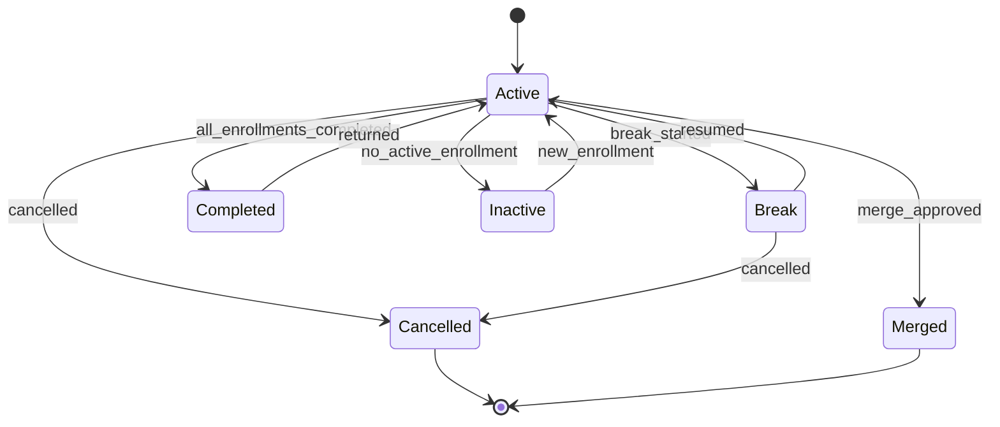

- **`Completed → Active` is legal and important.** A returning student reuses the same
  identity — rule 2. No new `STU-` is ever issued to a returning family.
- `Merged` is terminal for the *source* record only, which is **retained** with
  `merged_into_student_id` set (rule 4). No delete.
- Lead/Prospect states are deliberately absent — DD §6.1 says leads are handled separately,
  and Sales stays in Delicio/TeliCRM for Phase 1.

---

## Enrollment — DD §8

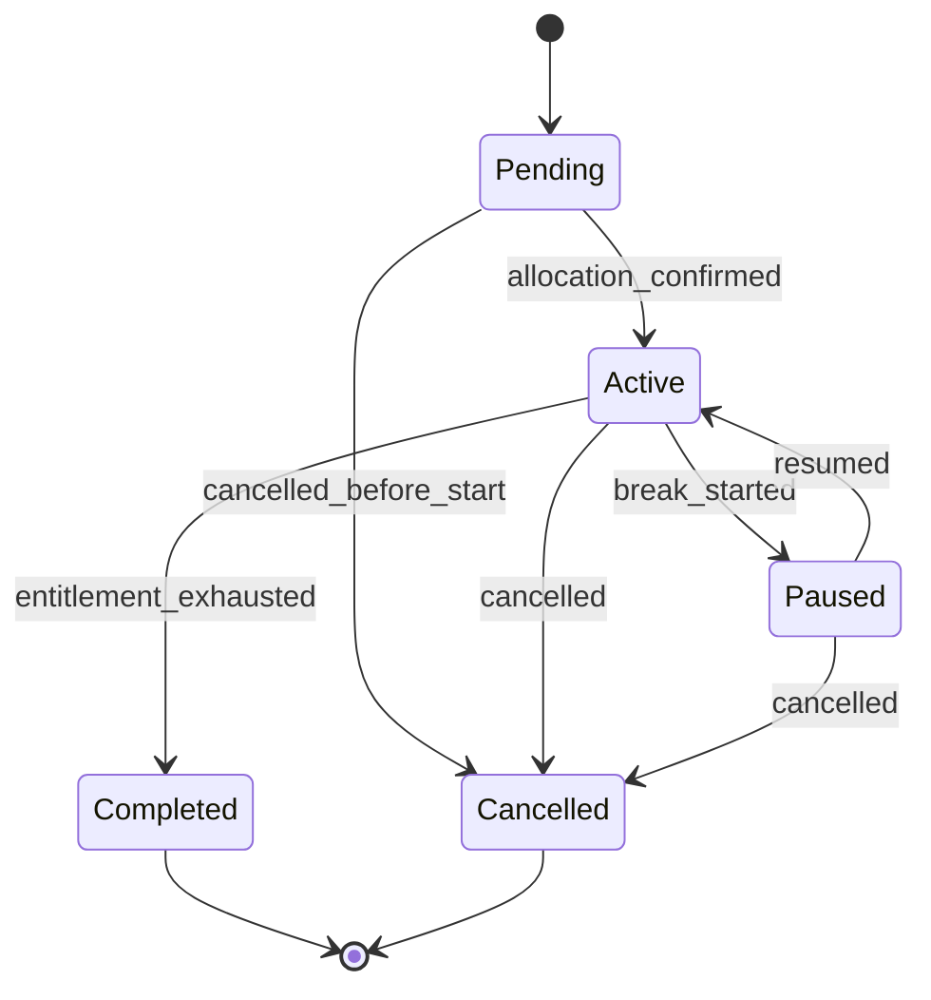

`Pending → Active` requires a current `teacher_allocation` **and** a current `class_schedule`.
An enrollment cannot go Active without both — allocation is teacher *plus* schedule (rule 9).

`end_reason` is mandatory on every transition into `Completed`, `Cancelled` or `Paused`
(DD §8).

---

## Subscription — DD §9

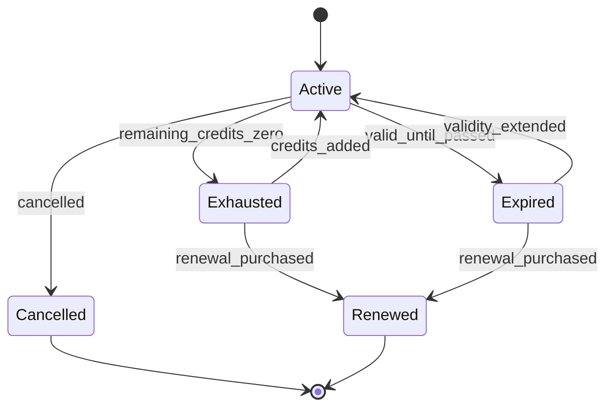

- `Exhausted` and `Expired` are **distinct**: out of sessions vs out of time. A subscription can
  be either without being both.
- Both are **reversible** — a compensation credit or an approved validity extension reopens it.
  Modelling these as terminal would break the compensation backlog (Master §25.1).
- `Renewed` points forward to the new subscription; the old record is retained.
- **No transition writes a balance.** Every balance change is a `session_credit_ledger` entry;
  status is derived from the ledger sum and `valid_until`.

---

## Admission Handover — Master §8

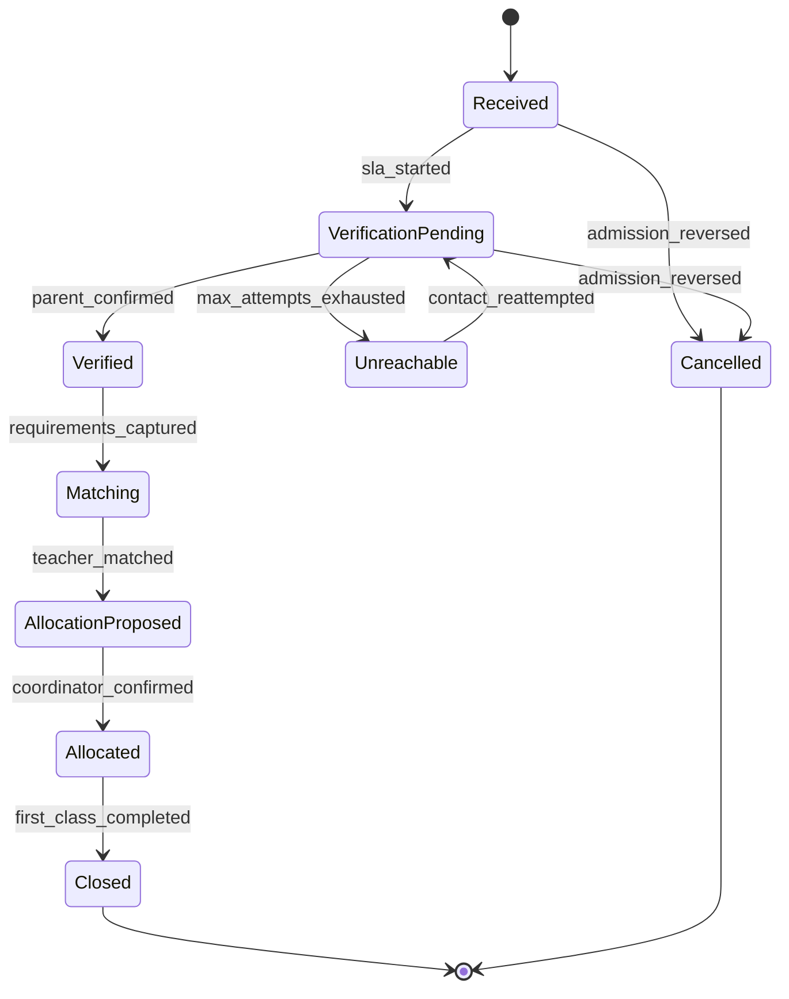

The SLA clock starts on entry to `VerificationPending` and stops on entry to `Allocated`
(the accepted default in `CLAUDE.md` §4 — 24h, unratified). `Unreachable` is a *pause*
condition candidate for the SLA policy — see [05](05-open-modelling-questions.md).

---

## Teacher Allocation — DD §13 (effective-dated)

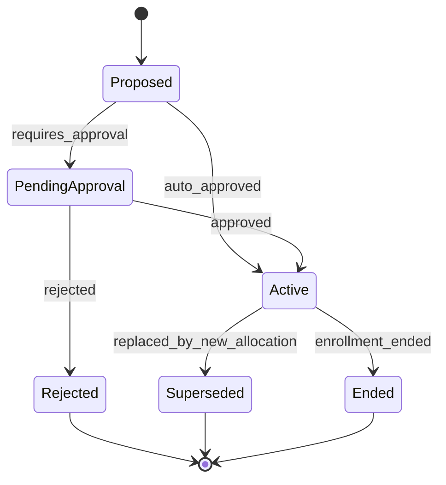

**`Active → Superseded` never UPDATEs the row's substance.** It sets `valid_to`, `is_current =
false` and `superseded_by_id`, then inserts a new row. Rule 12: teacher changes create history.

`Proposed → Active` is **blocked** when `teacher.is_allocation_eligible = false` (rule 25),
and blocked when the teacher's capacity for the slot is exhausted.

---

## Class Schedule — DD §15 (versioned)

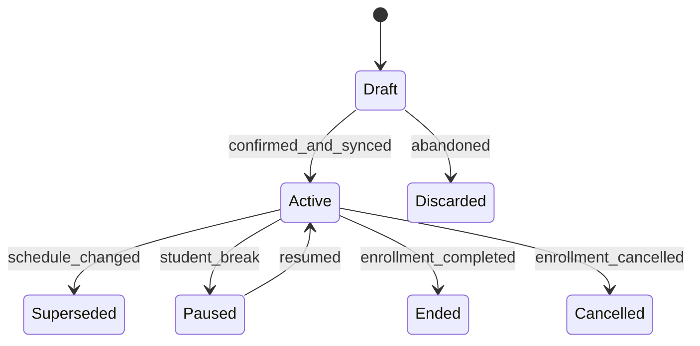

`Draft → Active` requires a successful Merithub class creation, or an explicit
operator override recorded with a reason. Rule 27 — a schedule must not silently go live while
the LMS believes it does not exist.

**A compensation session never causes a schedule transition** (rule 18).

---

## Session — DD §16, Master §15.1

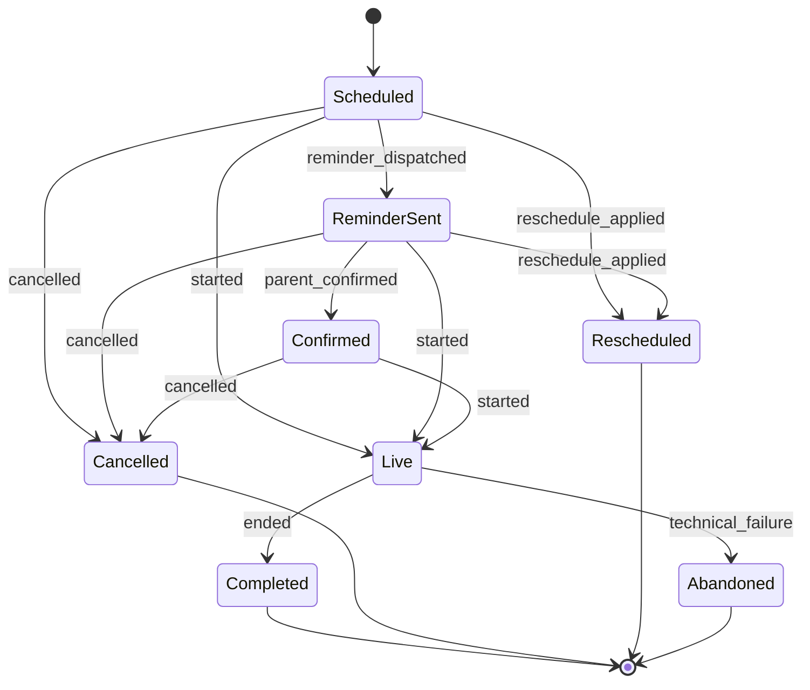

On entry to any terminal state, an **`outcome`** must be set. The outcome — not the status —
drives credit impact and compensation.

### Session outcome → credit impact

> **This is the highest-risk table in the model.** It decides whether a parent's purchased
> session is consumed or protected. Every value below is an **engineering default**
> (`source = 'engineering_default'`, `ratified_at = NULL`) and requires business ratification
> before go-live. Every row is resolved from `policy_parameter` at decision time and stamped
> onto the ledger entry with its version — never hard-coded.

| Outcome | Credit impact | Compensation | Source |
|---|---|---|---|
| Attended / Completed | `consumed` −1 | No | Master §15.1 |
| Partial attendance (≥ threshold) | `consumed` −1 | No | DD §17 — threshold is policy |
| Partial attendance (< threshold) | `protected` | **Yes** | [ENGINEERING] |
| Student absent / no-show | `consumed` −1 | No | Master §15.1 |
| Parent advance cancellation (outside cutoff) | `protected` | No — session released, not owed | Master §15.3 |
| Parent late cancellation (inside cutoff) | `consumed` −1 | No | Master §15.3 |
| Teacher absent | `protected` | **Yes** | Master §15.4 |
| Teacher-side technical issue | `protected` | **Yes** | Master §15.4 |
| Spellzee cancellation | `protected` | **Yes** | Master §15.4 |
| Student-side technical issue | `consumed` −1 (one goodwill exception per subscription) | No | [ENGINEERING] — Master §30 explicitly open |
| Rescheduled | no ledger entry | No | The moved session carries the credit |
| Compensation session completed | `compensated` −1 | — | Master §15.7 |

**Invariant (rule 17):** every terminal session outcome produces **exactly one**
`session_credit_ledger` entry per participant, except `Rescheduled` which produces none. A
terminal session with no ledger entry is a reconciliation failure and must alarm.

---

## Attendance — DD §17

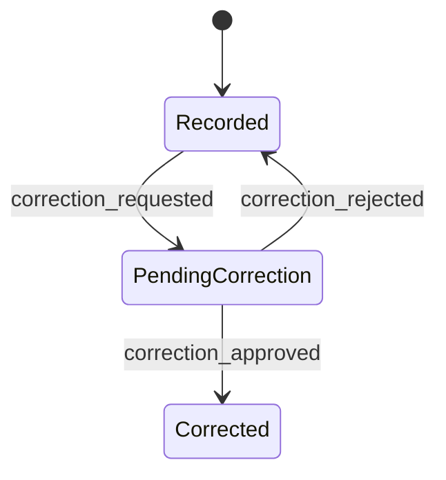

Corrections require `correction_reason`, `corrected_by` and `approved_by` (DD §17). The
original values are preserved in `audit_event` — the correction overwrites nothing that cannot
be recovered.

---

## Compensation — DD §18

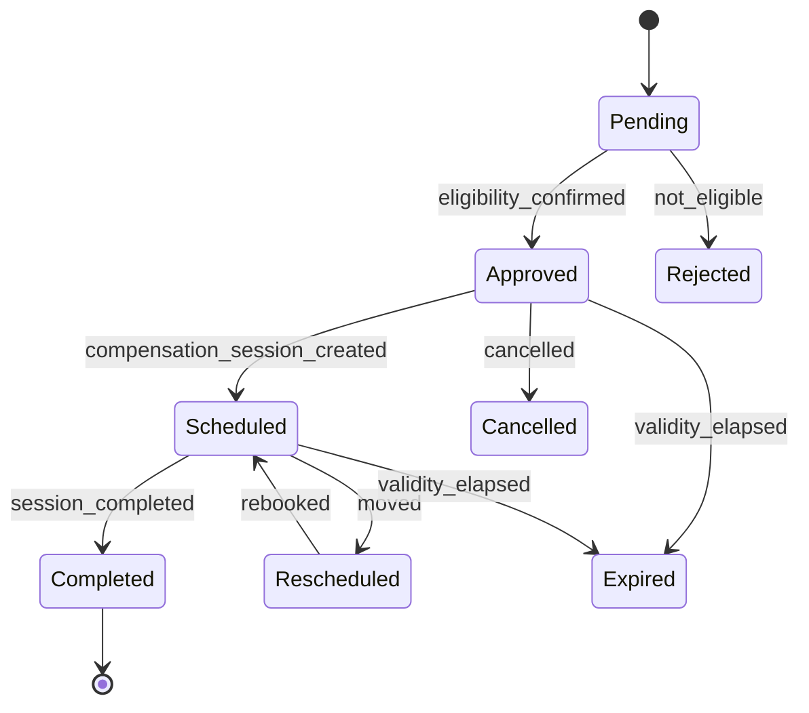

- `reschedule_count` increments on every `Scheduled → Rescheduled`; the max is a policy
  parameter (default 3, unratified).
- `Expired` releases the protected credit per policy — currently it **stays protected** rather
  than being consumed, pending ratification. This is a real money question:
  see [05](05-open-modelling-questions.md).
- **No transition here may touch `class_schedule`** (rule 18).

---

## Reschedule Request — DD §19

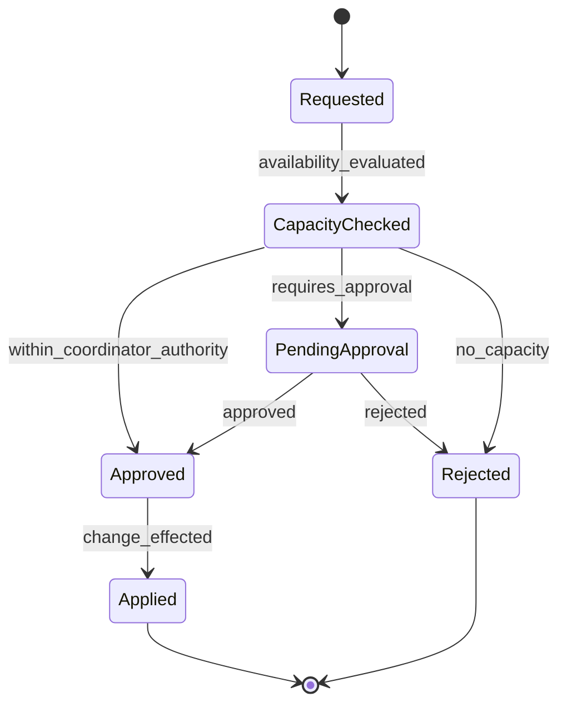

`Applied` is the only state that mutates a session or schedule, and it does so by
**superseding**, never by editing in place.

---

## Ticket — DD §31, Master §20

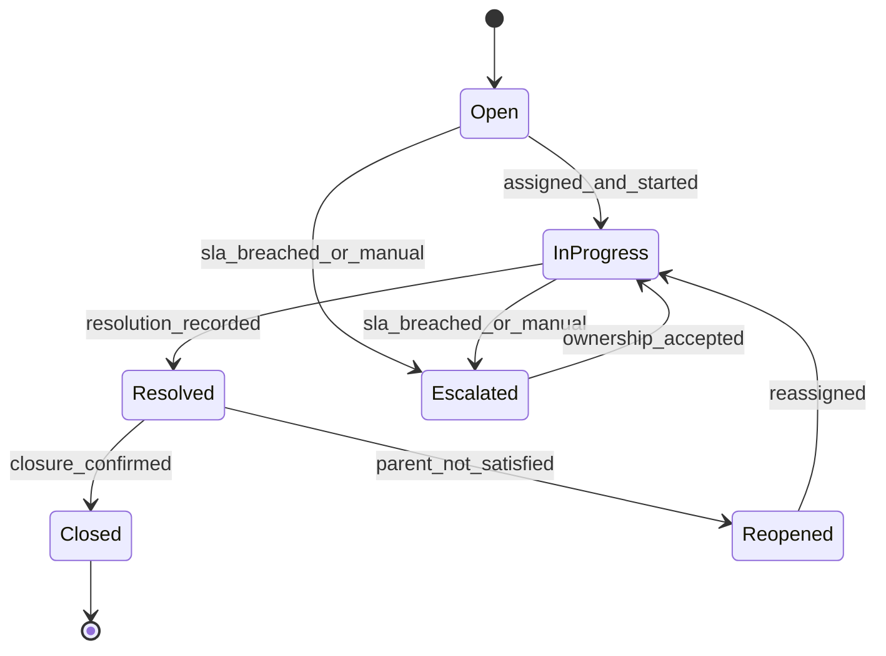

`Resolved` requires a `resolution`. `Escalated` is a state, not a flag, because ownership
genuinely changes — and that change writes a `coordinator_ownership` row with
`ownership_role = 'escalation'` (rule 12).

---

## SLA Instance — DD §32

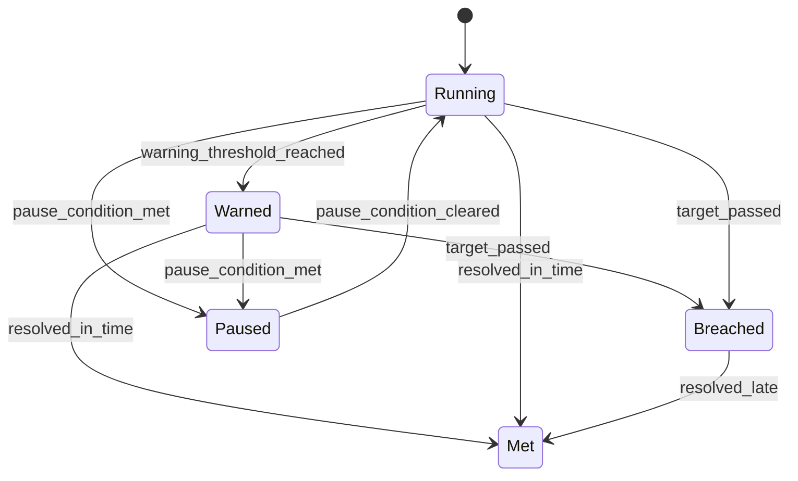

`Breached → Met` is deliberate: late resolution must still be recorded as resolution, while the
breach remains permanently visible in history. Overwriting the breach would violate rule 11.

---

## Approval Request — DD §39

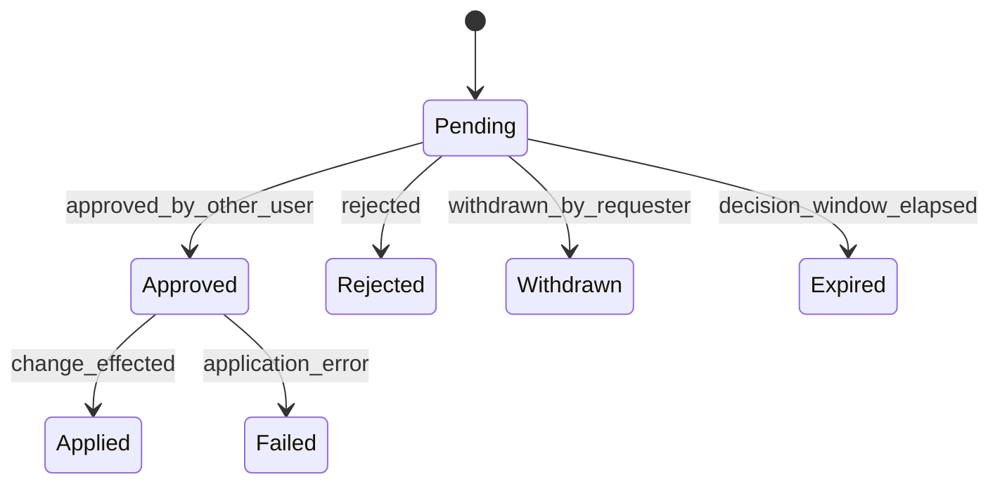

`Pending → Approved` is **blocked at the database level** when the approver equals the
requester (rule 22). `Approved → Applied` is separate from approval itself so that a failure to
apply an approved change is visible rather than silently lost.

---

## Cross-cutting transition rules

1. Every transition writes an `audit_event` with `old_value`/`new_value` — by trigger, not by
   application code (rule 21).
2. Every transition into a terminal or exceptional state requires a **reason**.
3. No status column is ever written directly by application code; the machine decides and the
   database validates against the transition table.
4. A transition that fails its guard writes an audit row with `outcome = 'blocked'`. Blocked
   attempts are evidence — DD §41 lists `blocked` as a first-class outcome.
